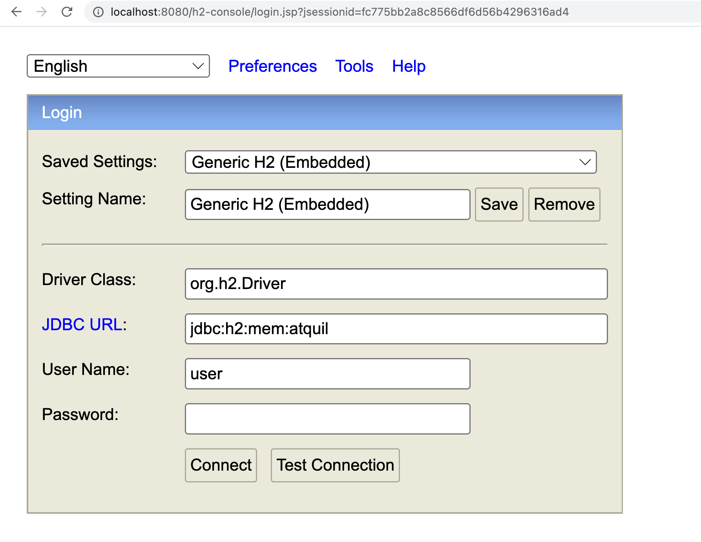
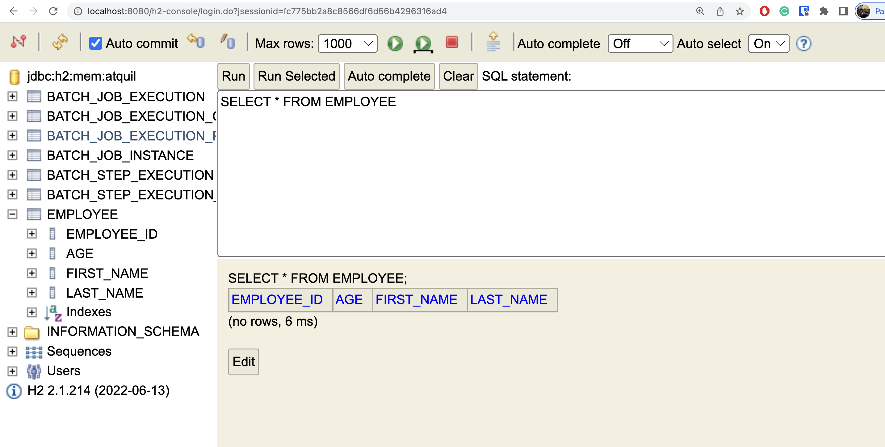
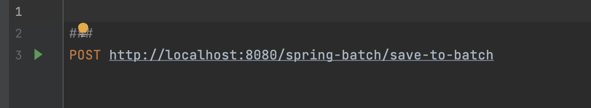
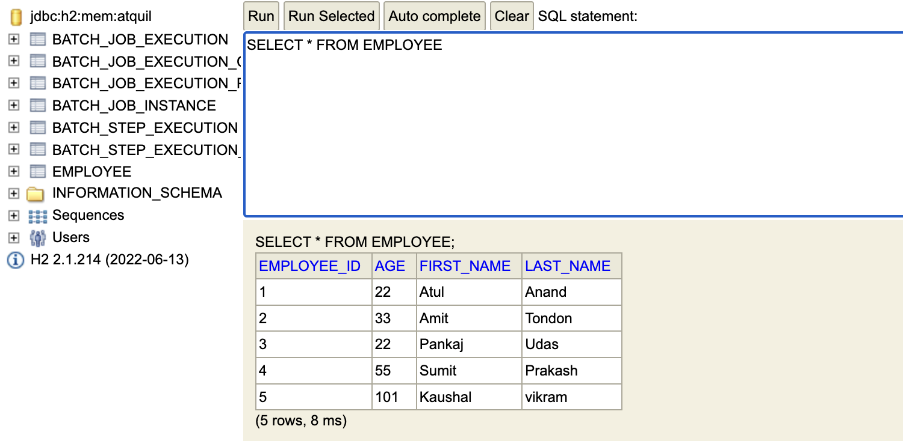

# Namestey!

## Spring batch with h2-database

It is mimicking the real life scenerio of interacting with SQL database like MySql. 

In this repo you will find two different way to trigger the spring batch. 
1. By using endpoint `spring.batch.job.enabled= false`
2. Automatic trigger of Batch Job `spirng.batch.job.enabled=true`

Moreover, we can also enable, asynchronous job, by simply telling the step to execute it in similar fashion
```aidl
 @Bean
    public TaskExecutor taskExecutor() {
        SimpleAsyncTaskExecutor asyncTaskExecutor = new SimpleAsyncTaskExecutor();
        asyncTaskExecutor.setConcurrencyLimit(10);
        return asyncTaskExecutor;
    }
```

uncomment task executor to run asynchronous job

```aidl

    @Bean
    public Step step1() {
        return stepBuilderFactory.get("csv-step").<Employee, Employee>chunk(10)
                .reader(reader())
                .processor(processor())
                .writer(writer())
                .taskExecutor(taskExecutor())
                .build();
    }
```
## Spring Batch Architecture


## When to use it ?

1. `Data Migration`: Moving data from one system (e.g. Legacy system) to other and doing processing to make it compatible on the go 
2. `Fast Processing`: Moving huge amount of data in parallel to save time but also having **robust transactional control** and **failure recovery mechanisms**
3. `Continuous Processing`: Having continuous data flow, spring batch allows optimized processing through configuration
4. `Task Orchestration`: To execute some complex task, having several macro operation spring batch provide Spring cloud dataflow
5. `ETL (Extract, Transform and Load)`: Generated file periodically needs to be transformed and loaded in database

## Outputs

After stating the application 

1. Open the database console using <domainname>/h2-console



2. Check the database before hitting the endpoint



3. Hit the endpoint


4. After hitting the endpoint
